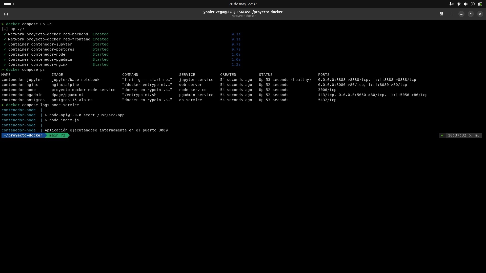
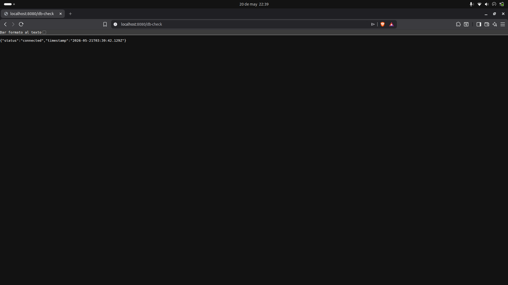
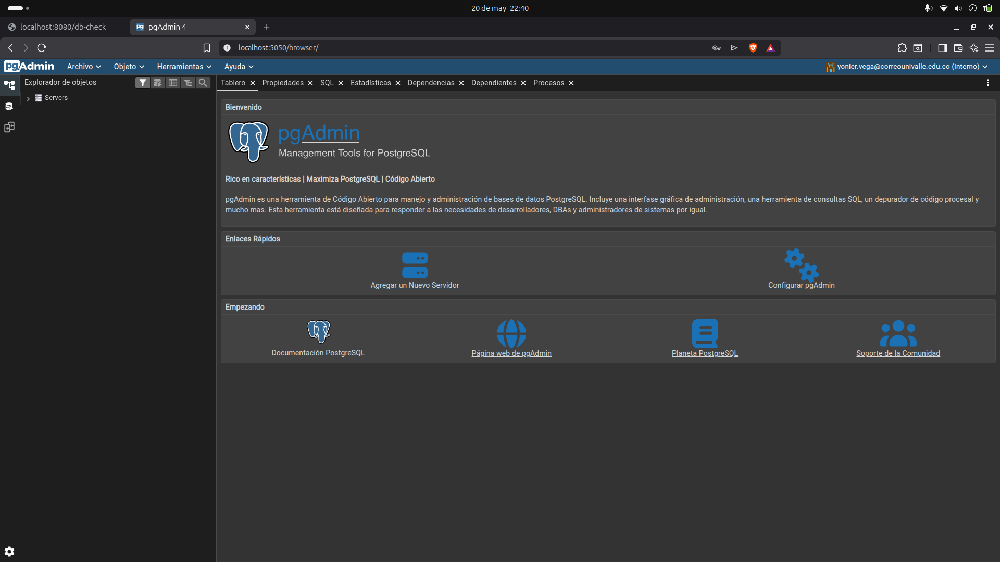
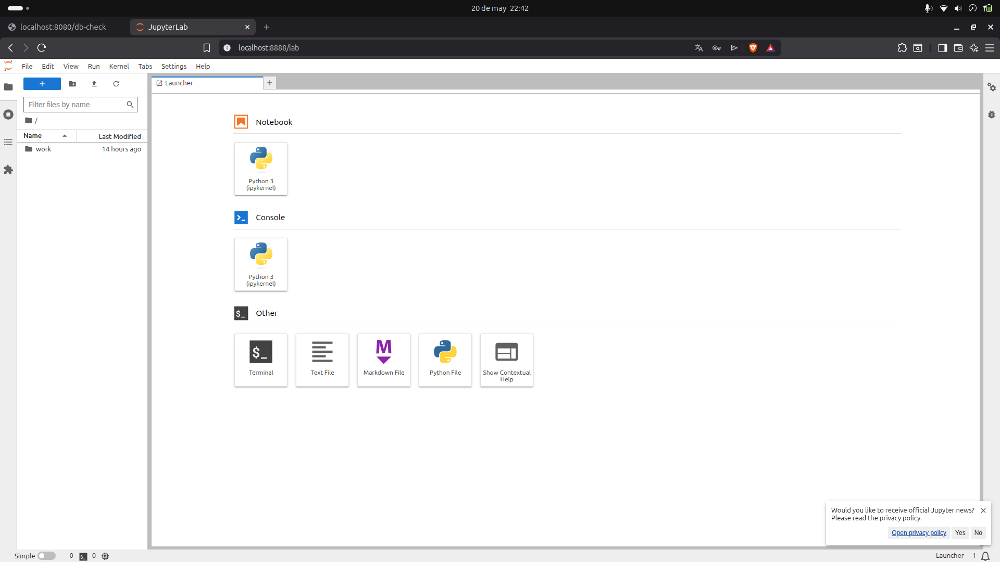
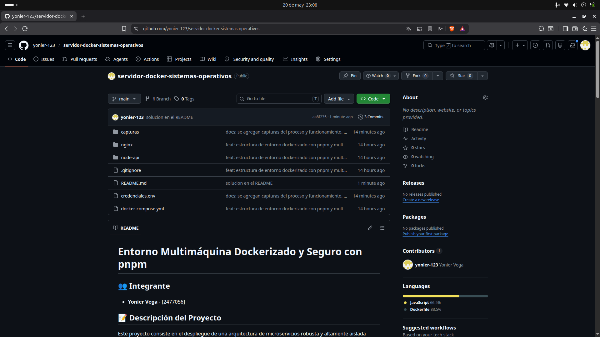

# Entorno Multimáquina Dockerizado y Seguro con pnpm

## 👥 Integrante
* **Yonier Vega** - [2477056]

## 📝 Descripción del Proyecto
Este proyecto consiste en el despliegue de una arquitectura de microservicios robusta y altamente aislada utilizando virtualización a nivel de Sistema Operativo mediante **Docker** y **Docker Compose**. La solución integra un servidor web, una API en Node.js blindada, un motor de base de datos relacional con persistencia administrada y un entorno completo de análisis de datos. 

Como factor diferenciador de alta seguridad y rendimiento, se migró la cadena de suministro de software de la API tradicional de `npm` hacia **`pnpm`**, mitigando los riesgos asociados a dependencias fantasma.

---

## 🏗️ Arquitectura del Entorno

La infraestructura está compuesta por 5 servicios aislados y organizados mediante dos redes lógicas internas, impidiendo la exposición innecesaria de recursos críticos al exterior:

1. **`web-server` (Nginx:alpine):** Proxy inverso que intercepta las peticiones en el puerto físico `8080` y las enruta internamente hacia la API.
2. **`node-service` (Node:18-alpine + pnpm):** Servidor de aplicaciones configurado de manera estricta y segura. Se comunica simultáneamente con las redes de frontend y backend.
3. **`db-service` (PostgreSQL:15-alpine):** Motor de base de datos relacional aislado por completo en la red interna del backend sin exposición de puertos externos.
4. **`pgadmin-service` (dpage/pgadmin4):** Interfaz gráfica web (puerto `5050`) para el control y auditoría visual del motor de bases de datos.
5. **`jupyter-service` (jupyter/base-notebook):** Suite de ciencia de datos corporativa (puerto `8888`) protegida por Token.

---

## 📋 Requisitos Previos
Para inicializar este entorno se requiere contar con las siguientes tecnologías operativas en la máquina anfitriona:
* **WSL2** (Windows Subsystem for Linux 2) con Distribución **Ubuntu** instalada.
* **Docker Engine** (Versión utilizada: 29.5.1 o superior).
* **Docker Compose v5** (Plugin CLI integrado).
* **Git** y cuenta activa en **GitHub**.

---

## 🚀 Pasos de Instalación y Despliegue

### 1. Clonar el repositorio

```bash
git clone https://github.com/yonier-vega/proyecto-docker.git
cd proyecto-docker
```

---

## 📸 Capturas de Pantalla (Evidencias Visuales)

1. **Evidencia de Inicialización y Comandos en la Terminal:**



*Muestra la ejecución del comando maestro `docker compose up -d`, seguido de `docker compose ps` para comprobar el estado saludable (Up) de los 5 contenedores en el Kernel de Ubuntu.*

2. **Validación de Interconexión y Conexión Exitosa (IPC):**



*Captura del navegador web en `http://localhost:8080/db-check` mostrando el objeto JSON con el estado `"status": "successful"`, lo que demuestra que el Proxy Inverso, la API y PostgreSQL se comunican correctamente en la red interna.*

3. **Interfaz Gráfica del Administrador de Base de Datos (pgAdmin 4):**



*Evidencia del panel web operativo en `http://localhost:5050` listo para la gestión, control y auditoría visual de las tablas del motor de bases de datos relacionales.*

4. **Entorno y Suite Analítica de JupyterLab:**



*Demostración del laboratorio interactivo de ciencia de datos en `http://localhost:8888`, confirmando que el volumen persistente y el Kernel de Python están listos para la ejecución de scripts.*

5. **Gobernanza del Código y Repositorio Configurado en GitHub:**



*Muestra la publicación oficial de la infraestructura en los servidores remotos de GitHub, garantizando el control de versiones seguro del proyecto.*
